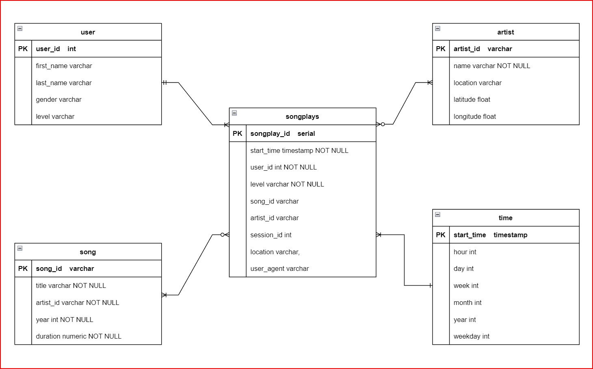

## Data Modeling with Postgres
 
### Project Background
A startup called Sparkify wants to analyze the data they've been collecting on songs and user activity on their new music streaming app. The analytics team is particularly interested in understanding what songs users are listening to. Currently, they don't have an easy way to query their data, which resides in a directory of JSON logs on user activity on the app, as well as a directory with JSON metadata on the songs in their app.

They'd like a data engineer to create a Postgres database with tables designed to optimize queries on song play analysis. So, this project is to create a database schema and ETL pipeline for the song play analysis. We will use Postgres for the data modeling, create the star schema database for analytic focus, and Python to build the ETL pipeline.

### Example Dataset

- **Song Dataset**:

Each file is in JSON format and contains metadata about a song and the artist of that song. The files are partitioned by the first three letters of each song's track ID. For example, here are file paths to two files in this dataset:

```
song_data/A/B/C/TRABCEI128F424C983.json
song_data/A/A/B/TRAABJL12903CDCF1A.json
```

And below is an example of what a single song file, TRAABJL12903CDCF1A.json, looks like:

```
{"num_songs": 1, "artist_id": "ARJIE2Y1187B994AB7", "artist_latitude": null, "artist_longitude": null, "artist_location": "", "artist_name": "Line Renaud", "song_id": "SOUPIRU12A6D4FA1E1", "title": "Der Kleine Dompfaff", "duration": 152.92036, "year": 0}
```

- **Log Dataset**: 

The second dataset consists of log files in JSON format generated based on the songs in the dataset above.

The log files in the dataset are partitioned by year and month. For example, here are filepaths to two files in this dataset:

```
log_data/2018/11/2018-11-12-events.json
log_data/2018/11/2018-11-13-events.json
```

And below is an example of one line of the data in a log file, 2018-11-12-events.json, looks like:

```
{"artist":null,"auth":"Logged In","firstName":"Walter","gender":"M","itemInSession":0,"lastName":"Frye","length":null,"level":"free","location":"San Francisco-Oakland-Hayward, CA","method":"GET","page":"Home","registration":1540919166796.0,"sessionId":38,"song":null,"status":200,"ts":1541105830796,"userAgent":"\"Mozilla\/5.0 (Macintosh; Intel Mac OS X 10_9_4) AppleWebKit\/537.36 (KHTML, like Gecko) Chrome\/36.0.1985.143 Safari\/537.36\"","userId":"39"}
```

### Database Schema for the Sparkify database



## Project Files
1. create_tables.py
2. sql_queries.py
3. etl.ipynb
4. ehl.py
5. test.ipynb
6. ER_Diagram.jpg
7. data/...
8. README.md

## How to run
1. Run create_tables.py ->  create the dababase and tables.
2. Run etl.py -> load the data from the json files, extract and transform the data required, then insert into the tables.
3. Run test.ipynb -> to perform the Sanity Tests, make sure there is no errors.
Note: To understnad the ETL process, please read and review the information in etl.ipynb
